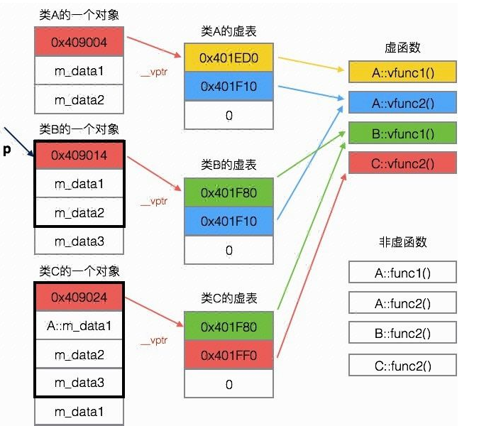

### 1. 继承

一个类继承另外一个类，可能出于:

-   实现继承: &ensp; 需要复用基类的变量与方法，在此基础上再定义自己的新东西
    -   子类的代码散步在两个类中，增加耦合；组合优于继承
-   接口继承 (子类型多态): &ensp; 需要向上转型与动态绑定

#### (1). 派生类构造函数

派生类的构造函数必须遵循:

-   先调用基类的构造器，再初始化自己的部分

C++ 中在初始表处调用基类的 ctor 即可，如果没调用就对基类成员执行默认初始化。

??? hint "cpp impl"

    ```cpp
    class Book {
        std::string isbn;
    public:
        Book(const std::string& isbn) : isbn(isbn) { }
    };

    class Fiction : public Book {
        int price;
    public:
        Fiction(const std::string& isbn, int price) : Book(isbn), price(price) { } // 顺序不同也行
    }
    ```

#### (2). 继承与访问控制

C++ 中，派生类对象中的基类子对象部分成员的访问权限受两个因素影响:

-   基类中该成员的访问说明符
-   派生类的派生列表中的访问说明符 (`class` 默认私有继承，`struct` 默认公有)

私有继承/保护继承会导致 (注: 派生访问说明符只影响对象的访问权限，类该是什么还是什么):

-   对派生对象的基类子对象成员的访问受限
-   派生类对象无法向上转型

私有继承的场景:

??? hint "e.g.1 &ensp; 实现某个类时只需要另一个类的某些实现，不需要继承关系"

    ```cpp
    class Timer {
    public:
        virtual void timeout() { ... }
    };

    class Widget : private Timer {
    public:
        virtual void timeout() {
            Timer::timeout();
            doSomething();
        }
    };
    ```

e.g.1 描述的是场景用组合实现更为合适，私有继承常用于空基类优化中。

??? hint "e.g.2 &ensp; 空基类优化 (EBO)"

    ```cpp
    class MyAllocator {
        void method1();
        void method2();
    };

    class MyVector : private MyAllocator {
        ...
    };
    ```

    为保证同一类型的不同对象地址始终有别，任何对象的大小至少为 1 (即使为空)，但基类子对象不受制约。在这个例子中:

    -  `MyVector` 需要 `MyAllocator` 的方法，但实现为组合会浪费空间
    -  直接 public 继承会使得 `MyVector` 可以转型为 `MyAllocator`，并不合适

#### (3). 其他零碎

-   一旦基类标记了某函数是 `virtual`，所有派生类中该函数都是虚函数，无需再加 `virtual`
-   `override` 有助于检查重写的人工错误 (形参列表后/引用限定符后/const 后)
-   子类型多态有时需要类型转换，可以使用 `static_cast` 或 `dynamic_cast`
-   对象之间不存在类型转换，只有拷贝 (`Derived d`):
    -   `Base b(d)`: &ensp; 调用 `Base::Base(const Base&)`
    -   `b = d`: &ensp; 调用 `Base::operator=(const Base&)`
-   `final` 关键字:
    -   修饰类 `class Base final {};` 禁止该类被继承
    -   修饰函数 `void func() const final;` 禁止该函数被覆盖
    -   修饰虚函数 `void func() override final;`，修饰派生类的时候有用，意图使覆盖到此为止

### 2. 绑定

派生类对象可以假设为多个子对象的线性排列，但变量名/函数名的访问是按作用域规则嵌套的，对形如 `obj.xxname` 的语句，需要将 `xxname` 绑定到某个子对象的成员，此即为绑定.

??? hint "判断是什么绑定"

    ```cpp
    class Fu {
    public:
        std::string name = "父变量";

        void show() {
            cout << this->name << endl;
            cout << this->func() << endl;
        }

        virtual std::string func() {
            cout << this->name << endl;
            return "父类调用";
        }
    };

    class Zi : public Fu {
    public:
        std::string name = "子变量";

        std::string func() {
            cout << this->name << endl;
            return "子类调用";
        }
    };

    int main() {
        Zi zi;
        Fu &fu = zi;
        cout << fu.name << endl;
        cout << fu.func() << endl;
        fu.show();
    }
    // 父变量 子变量 子类调用 父变量 子变量 子类调用
    ```

#### (1). 静态绑定 & 动态绑定

静态绑定 —— 从静态类型开始的名字查找

-   从变量的 <u style="text-decoration-style:wavy">静态类型</u> 出发，向外层作用域寻找该名字的定义在哪
-   找到后，如果是函数名，还会进行类型检查 (不通过就报错)

若 `name` 是虚函数名且 `obj` 是引用/指针，运行时执行动态绑定 —— 从动态类型开始的名字查找

-   从变量的 动态类型 出发，向外层作用域寻找名字定义
-   函数类型检查

二者对比:

-   名字查找的逻辑一样但实现不同，静态绑定编译期进行，动态绑定在运行时查找类的虚表实现

??? hint "动态绑定的具体实现"

    ```cpp
    class A {                     class B : public A {          class C : public B {
    public:                       public:                       public:
        virtual void vfunc1();        virtual void vfunc1();        virtual void vfunc2();
        virtual void vfunc2();        void func1();                 void func2();
        void func1();
        void func2();
    private:                      private:                      private:
        int m_data1, m_data2;          int mdata_3;                 int m_data1;
    };                            };
    ```

    <font class="u_1">

    -   每个包含虚函数的类都有一个虚表 (指针数组)，其中保存函数指针，注意虚表是属于类的
    -   虚表给出了该类的虚函数名字绑定到哪个实例上，这些在编译时可以确定
    -   编译器在类中创建一个虚表指针 `vptr`，使得对象实例化时包含虚表指针

    </font>

    &emsp;&emsp; 

    由此可见，虚函数的代价在于需要额外空间，且运行时需要额外时间进行名字查找

#### (2). 函数重载 & 静态绑定

编译时「先静态绑定再类型检查」，可能导致派生类函数名错误地遮蔽了基类的函数名

-   动态绑定相当于把重载函数视为不同函数，这也是二者名字查找过程的区别之一

??? hint "e.g.1 &ensp;派生类想增加一个新重载"

    派生类增加新重载使对 `f` 的查找卡在 `derived`，造成类型检查错误

    ```cpp
    struct Base {
        void f(int) { cout << "Base 1xint" << endl;}
    };

    struct Derived : public Base {
        void f(int, int, int) { cout << "Derived 3xint" << endl; }
    };

    int main {
        Derived d;
        d.f(1); // error
    }
    ```

??? hint "e.g.2 &ensp; 派生类只想重写一部分父类的重载函数"

    派生对象要想访问父对象的全部重载函数

    - 要么一个也不重写，名字查找过程会自动到父类的作用域
    - 要么全部重写

    而只想重写一部分就会导致另一部分无法访问。

    ```cpp
    struct Base {
        virtual f(int) { cout << "Base 1xint" << endl; }
        virtual f(int, int) { cout << "Base 2xint" << endl; }
    };

    struct Derived : public Base {
        virtual f(int, int) { cout << "Derived 2xint" << endl; }
    };

    int main {
        Derived* d;
        Base* b = d;
        b->f(1); // correct
        d->f(1); // compile error
    }
    ```

在 `Derived` 中声明一个 `using Base::f;`，类型不匹配的函数会转而访问这个 `using` 声明点。

#### (3). 作用域运算符

通过 `derived->Base::func()` 的形式，可以：

-   在派生类中访问基类中的同名变量或函数
-   回避动态绑定

??? hint "e.g.1 &ensp; 名字冲突时，使用作用域运算符访问隐藏成员"

    ```cpp
    struct Base {
        int mem = 0;
    };

    struct Derived : Base {
        int mem = 100;
        int getMem() { return Base::mem; }
    };
    ```

??? hint "e.g.2 &ensp; 回避动态绑定"

    ```cpp
    struct Base {
        virtual void func() { }
    };

    struct Derived : public Base {
        void func() {
            this->Base::func();
            doSomething();
        }
    };

    int main {
        Base *b = new Derived();
        b->func();
    }
    ```

#### (4). 虚标记的意义

考虑普通调用 `d->func()` 和多态调用 `b->func()`

-   编译时无法获取动态类型，要想获取动态类型必须付出代价
-   希望普通调用不付出代价，而只有多态调用付出运行时的代价

因此引入了 `virtual` 标记，表明虚函数是「需要多态调用的函数」

??? hint "为什么确定动态类型要推到运行时?"

    接口继承/子类型多态/向上转型/动态绑定，均指 oop 中的以下场景:

    ```cpp
    class Base { ... };
    class Derived : public Base { ... };
    ...
    Derived derived
    Base& base = derived;
    base.func();
    ```

    `base` 的静态类型是 `Base`，动态类型 (实际绑定的类型) 是 `Derived`，需要注意

    -   编译时未必可以确定一个变量的动态类型

    把 `derived` 的 `func()` 绑定到 `base` 上必须推到运行时

这样设计会引入“非虚函数使用多态调用”这种语法正确的错误行为，这也符合 C++ 「相信程序员，提供灵活性」的宗旨

### 3. 抽象类和接口

抽象类和接口是更加倾向接口继承的基类，归一化共同的行为，舍弃复用的耦合

-   抽象类: 可以定义变量、普通函数和抽象函数 (保留一部分复用)，但不能被实例化，只能单继承
-   接口: 在抽象类基础上，变量只能是 `public static final`，函数只能是抽象函数，可以多继承

C++ 中，在虚函数声明的分号前加 `=0` 即可声明纯虚函数，包含纯虚函数的类是抽象类
