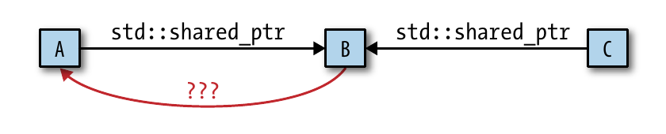

### 1. RAII 与智能指针

RAII (Resource Acquisition Is Initialization) 是 C++ 管理资源的方式: 把资源封装在类中，对象生存期结束后自动析构:

-   栈对象离开作用域即结束生存期
-   堆对象被释放后结束生存期

这样做的好处在于 (按重要性先后排序):

-   明确资源的所有权
-   避免忘记资源的释放 (如 `delete` 指针)
-   处理异常等

??? hint "example of RAII"

    ```cpp
    void bad() {
        m.lock();         // 请求互斥体
        f();              // 若 f() 抛异常，互斥体永不释放
        if (...) return;  // 提前返回，互斥体永不释放
        m.unlock;
    }
    ```

    将互斥体封装在 class 中，生存期结束后自动释放

    ```cpp
    void good() {
        std::lock_guard<std::mutex> lock(m);
        f();
        if (...) return;
    }
    ```

??? hint "所有权"

    所有权 (ownership): 对象 A 负责对象 B 的创造和释放等，就说 A owns B

指针通常与动态内存关联，因而也需要作为一种资源由 RAII 管理。关于使用智能指针和裸指针的时机:

-   当有所有权的语义，即指针需要作为资源被管理，使用智能指针
-   没有所有权语义，只是用裸指针访问资源，裸指针结束生存期后也不需要它释放资源 (例如只是用裸指针访问一些数据)

### 2. `unique_ptr`

关于独占所有权的智能指针的发展:

-   `auto_ptr`:&ensp; 旧 C++ 的产物，使用拷贝和赋值实现「独占所有权」的「移动语义」，这导致了赋值会使原对象变为 null 的迷惑行为，以及无法将 `auto_ptr` 放入容器
-   `unique_ptr`:&ensp; C++11 引入移动语义的产物，move-only 且解决了 `auto_ptr` 的痛点

`unique_ptr` 的特点:

-   额外空间开销小，可近似认为等于裸指针；move-only；管理独占所有权语义的指针
-   支持自定义删除器，有状态的删除器和函数指针会增加 `unique_ptr` 对象的大小
-   很容易转化为 `shared_ptr`

// ToDo: example of factory

### 3. `shared_ptr`

当某个指针不被某个特定的智能指针对象所有，具有「共享所有权」语义，就适用 `shared_ptr`。它需要更大的开销:

-   初始化第一个 `shared_ptr` 时，同时还需要初始化一个 object 和一个控制块 (包含 ref count、weak count、custom deleter, etc.)
-   每个 `shared_ptr` 需要包含对原对象的引用和对控制块的引用，约为裸指针的 2 倍空间
-   递增递减引用是原子性的，比非原子操作慢

`shared_ptr` 用以上代价换取自动垃圾回收。

??? hint "对比 `shared_ptr` 和 `unique_ptr`"

    二者除本质区别外，使用上的区别:

    -   `shared_ptr` 也支持自定义删除器，但不内嵌在类型信息中
    -   `shared_ptr` 不支持数组

??? hint "`shared_ptr` 支持的操作"

    | op                         | description                               |
    | -------------------------- | ----------------------------------------- |
    | `shared_ptr<T> sp;`        | 值初始化为一个空指针                      |
    | `p`, `*p`, `p->mem`        | 可以像普通指针一样使用智能指针的变量名    |
    | `make_shared<T>(args)`     | 以 emplace 的方式初始化                   |
    | `shared_ptr<T> p(q);`      | 拷贝初始化，递增 `q` 中的计数器           |
    | `p = q`                    | 赋值，递减 `p` 的计数，递增 `q` 的计数    |
    | `swap(p, q)` / `p.swap(q)` | 交换 `p` 和 `q` 的指针                    |
    | `p.get()`                  | 返回 `p` 中保存的原始类型指针，应小心使用 |
    | `p.use_count()`            | 返回 `p` 的计数，可能很慢，主要用于调试   |

#### (1). 初始化

`shared_ptr` 有两种初始化方式:

-   通过 `make_shared` 以 emplace 的方式
-   直接初始化，通过原始指针变量 (或 `unique_ptr`)

首先应避免从原始指针上创建 `shared_ptr`，非此不可也要使用临时对象

??? caution "example"

    ```cpp
    void process(shared_ptr<int> ptr) { }
    ...
    int *x(new int(1024));
    process(shared_ptr<int>(x));
    int j = *x;
    cout << j << endl;
    ```

    由于混用了原始指针和 `shared_ptr`，导致了 undefined

??? caution "`enabled_shared_from_this`"

    ```cpp
    // 用于跟踪已经处理过的 Widget 的数据结构:
    std::vector<std::shared_ptr<Widget>> processedWidgets;
    // Widget 类
    class Widget {
    public:
        void process() {
            ...
            processedWidgets.emplace_back(this);
            // 错误: 相当于新开了一个 shared_ptr
        }
    };
    ```

    需求: 在类内拿到一个 `this` 的 `shared_ptr`，且这个 `shared_ptr` 不是第一个

    ```cpp
    class Widget: public std::enable_shared_from_this<Widget> {
    public:
        void process() {
            ...
            processedWidgets.emplace_back(shared_from_this());
        }
    };
    ```

<!-- prettier-ignore-start -->

而对比「使用 `make_shared` 初始化」和「使用 `new` 的临时对象直接初始化」也是前者更好，原因在于:

1 . 使用 `make_shared` 可以少打一次类型，减少重复代码

:   
    ```cpp
    auto spw1(std::make_shared<Widget>());      //使用make函数
    std::shared_ptr<Widget> spw2(new Widget);   //不使用make函数
    ```

2 . 使用 `make_shared` 更加异常安全

:   
    ```cpp 
    processWidget(std::shared_ptr<Widget>(new Widget), computePriority()); 
    ```

    函数传参前必须先计算实参，而编译器在转换目标代码时不必按照顺序，可能产生 `new Widget` > `computePriority` > `shared_ptr ctor` 的顺序，`computePriority` 可能会抛出异常，导致 `new Widget` 泄漏

3 . 使用 `make_shared` 内存分配更少

:   
    `std::shared_ptr<Widget> spw(new Widget);` new 对象一次分配，控制块又一次分配 <br>
    `auto spw = std::make_shared<Widget>();` 分配一块内存，同时容纳对象和控制块

<!-- prettier-ignore-end -->

需要考虑一些只能用直接初始化的特殊情况

-   需要自定义删除器或花括号初始化
-   ...

### 4. `weak_ptr`

??? hint "`weak_ptr` 支持的操作"

    | op                     | description                                                                                       |
    | ---------------------  | ------------------------------------------------------------------------------------------------- |
    | `weak_ptr<T> wp(sp);`  | 和 `shared_ptr` 指向相同对象                                                                      |
    | `wp = p`               | `p` 可以是 `shared_ptr` 或 `weak_ptr`                                                             |
    | `wp.reset()`           | 将 `wp` 置为空                                                                                    |
    | `wp.use_count()`       | 共享的 `shared_ptr` 数量                                                                          |
    | `wp.expired()`         | 是否过期，即 `use_count == 1`                                                                     |
    | `wp.lock()`            | 若 `expired` 为 true，返回一个空的 `shared_ptr`，<br> 否则返回指向 `wp` 的资源对象的 `shared_ptr` |
    | `shared_ptr<T> sp(wp)` | 若 `wp` 悬空，会抛出 `std::bad_weak_ptr` 异常 |

`weak_ptr` 的特性:

-   和 `shared_ptr` 配套使用，且不增加引用计数
-   在悬空 (dangle) 时可以知晓 (`wp.expired()`)

`weak_ptr` 需要一个操作:

-   当 `weak_ptr` 过期，返回一个空指针；否则返回引用的资源 (的 `share_ptr`)
-   若按 `if !expired then 解引用` 实现会造成竞态条件 (`weak_ptr` 不支持解引用)，因此由 `lock()` 实现

`weak_ptr` 的代价与 `shared_ptr` 相当，需要对控制块的引用，对 weak count 的加减涉及原子操作。

??? hint "为什么需要 weak count"

    `weak_ptr` 需要一个数据结构判断是否过期，因此 `shared_ptr` 的析构逻辑为: 当 `ref_count=0`，析构资源，此时 `wp` 已经无法转换为 `sp`，然后当 `weak_count` 也为 0，再析构控制块

`weak_ptr` 潜在的使用场景包括 缓存、观察者列表、打破 `shared_ptr` 的环状结构

#### (1). 缓存

考虑一个 naive 的工厂函数，返回一个只读对象的智能指针

```cpp
std::unique_ptr<const Widget> loadWidget(WidgetID id);
```

场景:

-   `loadWidget` 是一个昂贵的操作 (需要操作文件或数据库 I/O)，且使用重复的 `id` 很常见
    -   引入缓存，则 `cache` 和调用者都需要 `Widget` 的指针，不能用 `unique_ptr`
-   调用者决定 `Widget` 的生存期：当没有 caller 使用 `Widget` 后，`Widget` 应该被销毁
    -   使用 `shared_ptr` 由于 `cache` 必须保存一份，无法实现没有 caller 使用就被销毁
-   `cache` 的指针需要判断，如果缓存的资源已经空悬就重新缓存
    -   裸指针做不到

??? hint "a quick-and-dirty implementation"

    ```cpp
    std::shared_ptr<const Widget> fastLoadWidget(WidgetID id) {
        static std::unordered_map<WidgetID, std::weak_ptr<const Widget>> cache;
        auto objPtr = cache[id].lock();
        if (!objPtr) {
            objPtr = loadWidget(id); // unique_ptr -> shared_ptr
            cache[id] = objPtr;      // shared_ptr -> weak_ptr
        }
        return objPtr;
    }
    ```

#### (2). Observer Design Pattern

`subject` 和 `observers` 存在一对多的关系，一旦 `subject` 做出改变，依赖它的 `observers` 需要改变状态，因此 `subject` 通常维护一个 `observerList`。

-   尽管 `observers` 是 `subject` 的成员，这是一个典型的 「无所有权」的例子，观察者和主题之间各有各的 lifespan
-   `subject` 仅需要知道保存的 `observer` 是否已经悬空，因此此处适用 `weak_ptr`

#### (3). `shared_ptr` 的循环引用



假设 `A` 和 `C` 共享 `B` 的所有权；且 `B` 指向 `A` 的指针也很有用，应该使用哪种指针:

-   原始指针: &ensp; 若 `A` 先被销毁，`C` 继续指向 `B`，且 `B` 无法判定指针是否悬空
-   `shared_ptr`: &ensp; 造成循环引用，`C` 被销毁后，`A` 和 `B` 都被泄露
-   `weak_ptr`: &ensp; 不会造成循环引用，也可以判定悬空

使用 `weak_ptr` 打破 `shared_ptr` 的循环也并不常用。以严格分层的数据结构为例，子结点只被父结点持有，父对子的引用可用 `unique_ptr` 实现，而由于子的生存期一定短于父结点，子结点不可能解引用悬挂的父指针，因此可用原始指针实现。
